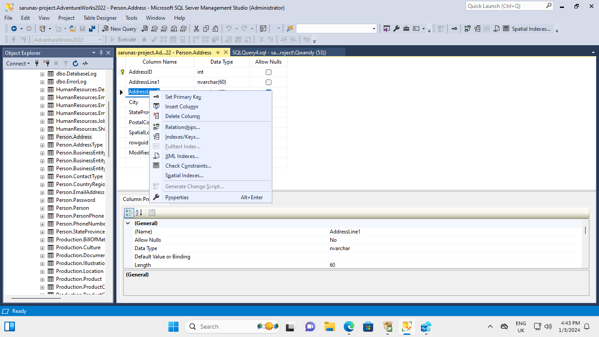

# azure-database-migration

## Milestone 1 / 2

For milestones 1 and 2 I have:
- Created an Azure VM and connected to it
- Set up SQL Server and SMSS.
- Restored the Adventureworks dataset onto SMSS

## Milestone 3

For milestone 3 I have:

- Set up an Azure SQL Database
- Installed Azure Data Studio and connected to localhost using it
- Connected Azure Data Studio to my Azure SQL Database
- Downloaded and installed the SQL Server Schema Compare extension
- Performed a Schema compare between localhost and the Azure SQL Database
- Downloaded and installed the Azure SQL Migration extension
- Performed a database migration to take my localhost Adventureworks dataset to the Azure SQL Database
- Verified that the database migration went well by doing a schema compare and inspected several tables within the dataset to ensure no random behavious exhibited

## Milestone 4

For milestone 4 I have:

- Backed up production database to Azure Storage
- Set up a new development virtual machine
- Installed Microsoft SQL Server, SMSS and Azure Data Studio
- Restored the production database using the .bak backup file I had uploaded on Azure Storage
- Created a backup schedule of my develop database which checks database integrity, rebuilds indexes and performs a differential backup every week on Sunday at midnight using SMSS

## Milestone 5

- I have dropped the AddressLine1 column from the Person.Address table using Table Designer in SMSS. This would be a pretty massive blunder in industry to wipe customer addresses without a backup plan. How I did this is shown in the pictures below.

- I restored the database using Azure's database restore button. This created a new production database where the critical data loss has been reversed.
- I created a geo-replica in the France Central server (Primary is UK south)
- I performed a failover to make the primary database the geo-replica
- I performed a failover to make the primary database the original database in UK South

## Milestone 6

- I set up a Microsoft Entra ID Admin
- I connected to the SQL Server to Azure Data Studio with my Microsoft Entra ID login
- I created a new user: db_datareader
- I created an IAM role (Reader) and assigned db_datareader to this role so they have read-only access to the database server
- Connected to database using db_reader user
- Ran 'SELECT * FROM Person.Address' SQL query to read some data
- Pulled up the 'table designer'. Right clicking the 'AddressLine1' column doesn't show a delete button, which did appear when I caused a critical dataloss as the system administrator. This proves that the db_reader user is working as intended