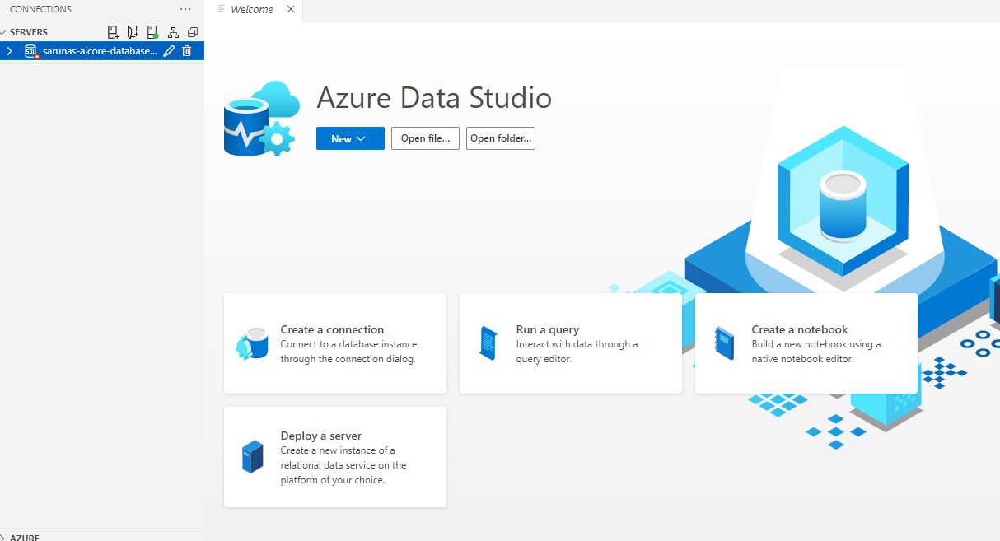
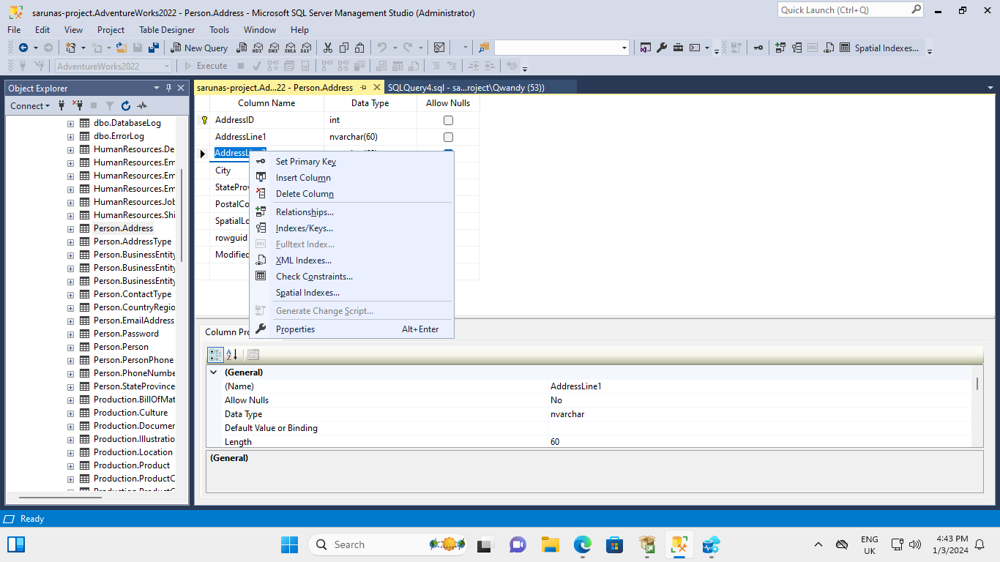

# azure-database-migration

## Table of Contents
- [Project Brief](#project-brief)
- [The Data](#the-data)
- [Tools Used](#tools-used)
- [Project Outline](#project-outline)

## Project Brief
This project was about setting up an Azure VM to host an on-site / local database, setting up the tools neccessary to query & migrate the database to the cloud. Some additional objectives were to create backups and backup schedules, create a critical database restore plan and test it using failover/tailback strategies, as well as set up Microsoft Entra ID and create role-based permissions for accessing the database.

## The Data
[AdventureWorks](https://dataedo.com/samples/html/AdventureWorks/doc/AdventureWorks_2/home.html). From the website:
>AdventureWorks is a sample database for Microsoft SQL Server 2008 to 2014. This is a documentation of this database created with Dataedo. AdventureWorks database supports standard online transaction processing scenarios for a fictitious bicycle manufacturer - Adventure Works Cycles. Scenarios include Manufacturing, Sales, Purchasing, Product Management, Contact Management, and Human Resources.

The data can be downloaded here: [AdventureWorks Data](https://learn.microsoft.com/en-us/sql/samples/adventureworks-install-configure?view=sql-server-ver16&tabs=ssms)

## Tools Used
- [Azure Virtual Machine (VM)](https://azure.microsoft.com/en-gb/products/virtual-machines): Physical computers accessed remotely via Microsoft's cloud infrastructure. Microsoft Azure provides hundreds of options to customise the VM to your needs and finances.
- [SQL Server Developer Edition](https://www.microsoft.com/en-us/sql-server/sql-server-downloads): Host a development and test database in a non-production environment. 
- [SQL Server Management Studio (SMSS)](https://learn.microsoft.com/en-us/sql/ssms/download-sql-server-management-studio-ssms?view=sql-server-ver16) From the website:
> SQL Server Management Studio (SSMS) is an integrated environment for managing any SQL infrastructure, from SQL Server to Azure SQL Database. SSMS provides tools to configure, monitor, and administer instances of SQL Server and databases. Use SSMS to deploy, monitor, and upgrade the data-tier components used by your applications and build queries and scripts. Use SSMS to query, design, and manage your databases and data warehouses, wherever they are - on your local computer or in the cloud.
- [Azure SQL Database](https://azure.microsoft.com/en-gb/products/azure-sql/database) for hosting a SQL Database using Azure's infrastructure.
- [Azure Data Studio](https://learn.microsoft.com/en-us/azure-data-studio/download-azure-data-studio?tabs=win-install%2Cwin-user-install%2Credhat-install%2Cwindows-uninstall%2Credhat-uninstall). From the website:
>zure Data Studio is a lightweight, cross-platform data management and development tool with connectivity to popular cloud and on-premises databases. Azure Data Studio supports Windows, macOS, and Linux, with immediate capability to connect to Azure SQL and SQL Server. Browse the extension library for more database support options including MySQL, PostgreSQL, and Cosmos DB.
- [SQL Server Schema Compare extension for Azure Data Studio](https://learn.microsoft.com/en-us/sql/ssdt/how-to-use-schema-compare-to-compare-different-database-definitions?view=sql-server-ver16) For comparing the schemas between the onsite/local database and the cloud database. It finds the differences and allows you to push the local schema to the cloud to facilitate a cloud migration. From the website:
> SQL Server Data Tools (SSDT) includes a Schema Compare utility that you can use to compare two database definitions. The source and target of the comparison can be any combination of connected database, SQL Server database project or snapshot or .dacpac file. The results of the comparison appear as a set of actions that must be taken with the target to make it the same as the source. Once the comparison is complete, you can update the target directly (if the target is a project or a database) or generate an update script that has the same effect.
- [Azure SQL Migration extension for Azure Data Studio](https://learn.microsoft.com/en-us/azure-data-studio/extensions/azure-sql-migration-extension) allows you to upload an onsite/local database to the cloud. From the website:
> The Azure SQL migration extension for Azure Data Studio enables you to assess, get right-sized Azure recommendations and migrate your SQL Server databases to Azure.
- [Azure storage](https://azure.microsoft.com/en-gb/products/storage/blobs) for uploading the database backup files.
- [Microsoft Entra ID](https://www.microsoft.com/en-gb/security/business/microsoft-entra) for implementing security policies for users.
- [Microsoft IAM](https://www.microsoft.com/en-gb/security/business/solutions/identity-access) for providing role-based permissions to users.

## Project Outline

## Milestone 1 / 2

For milestones 1 and 2 I have:
- Created an Azure VM and connected to it. The VM is incredibly important for this project as it allows me to host the SQL Server locally.
- Set up SQL Server and SMSS. These tools allow me to set up an SQL Server, and manage it.
- Restored the Adventureworks dataset onto SMSS. 

## Milestone 3

For milestone 3 I have:

- Set up an Azure SQL Database. This is the first step to setting up a cloud solution.
- Installed Azure Data Studio and connected to localhost using it. Data Studio is a robust piece of software that allows you to perform CRUD operations and queries on your database.

- Connected Azure Data Studio to my Azure SQL Database. 
- Downloaded and installed the SQL Server Schema Compare extension. This allows me to compare the schema between my onsite/local database and the one stored in the cloud, as well as push the differences to the cloud to facilitate a migration.
- Performed a Schema compare between localhost and the Azure SQL Database.
- Downloaded and installed the Azure SQL Migration extension. This is a very important tool for this project as it allows me to actually to transfer the database from onsite/local to the cloud.
- Performed a database migration to take my localhost Adventureworks dataset to the Azure SQL Database.
- Verified that the database migration went well by doing a schema compare and inspected several tables within the dataset to ensure no random behavious exhibited. 

## Milestone 4

For milestone 4 I have:

- Backed up production database to Azure Storage. Backups are very important in cloud solutions because in the event that something goes wrong, I am able to restore the database back to it's last legitimate form. I was happy to learn that you can automate backups very easily using SMSS. You can tinker with the settings to perform these backups during low-traffic hours, or during the same times as scheduled maintenance.
- Set up a new development virtual machine using Azure.
- Installed Microsoft SQL Server, SMSS and Azure Data Studio on the development VM.
- Restored the production database using the .bak backup file I had uploaded on Azure Storage.
- Created a backup schedule of my develop database which checks database integrity, rebuilds indexes and performs a differential backup every week on Sunday at midnight using SMSS. I set it up that the backup files are uploaded locally and directly to the cloud, to ensure reliability. Differential backups work very similarly to Git in the sense that changes in the database are recorded. This saves storage space, and therefore cuts costs.

## Milestone 5

- I have dropped the AddressLine1 column from the Person.Address table using Table Designer in SMSS. This would be a pretty massive blunder in industry to wipe customer addresses without a backup plan. How I did this is shown in the pictures below.

I pressed the delete column button to remove the column

- I restored the database using Azure's database restore button. This created a new production database where the critical data loss has been reversed.
- I created a geo-replica in the France Central server (Primary is UK south). Geo-replicas are important because in the sitatuation that unplanned server outage occurs (due to a natural disaster at the region of the data center for example), the database can still be accessed from the secondary region.
- I performed a failover to make the primary database the geo-replica. 
- I performed a tailback to make the primary database the original database in UK South. It's important to test these strategies because in the situation that something unexpected occurs, it's easy to keep everything running when you know how to do it.

## Milestone 6

- I set up a Microsoft Entra ID Admin user. Microsoft Entra ID is a very useful and powerful security tool. It provides strong authentication policies and a seamless user experience. Security is very important in cloud solutions because everything is public (unless you opt for private access), so it's important to make sure that no unintended users are able to access the cloud solution and cause breakages, or steal data.
- I connected to the SQL Server to Azure Data Studio with my Microsoft Entra ID login.
- I created a new user: db_datareader which has read only access to the database.
- I created an IAM role (Reader) and assigned db_datareader to this role so they have read-only access to the database server.
- Connected to database using db_reader user.
- Ran 'SELECT * FROM Person.Address' SQL query to read some data. This verified that the user role works.
- Pulled up the 'table designer'. Right clicking the 'AddressLine1' column doesn't show a delete button, which did appear when I caused a critical dataloss as the system administrator. This proves that the db_reader user is working as intended.

